# ERD per domain (lengkap dengan kolom)

Dibuat otomatis oleh `scripts/generate-erd.mjs` dari `database/001_create_tables.sql` dan `supabase/migrations/`. Jangan diedit manual; jalankan ulang skripnya.

**66 tabel, 194 relasi foreign key.** Notasi: `PK` primary key, `FK` foreign key, `UK` unique; `A ||--o{ B` artinya satu baris A dirujuk banyak baris B (label = kolom FK di B).

## 1. Akun & peran

Tabel: `users`, `daycare_members`, `staff_invitations`, `daycare_delegations`, `delegation_permissions`, `account_sanctions`. Tabel dari domain lain yang dirujuk ditampilkan tanpa kolom.

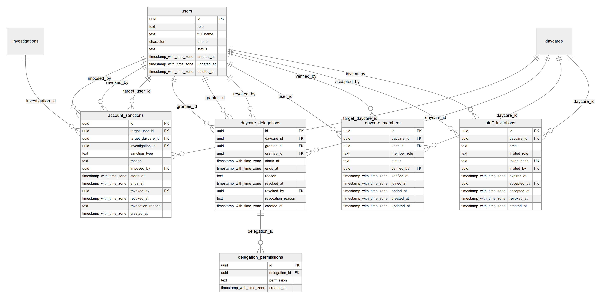

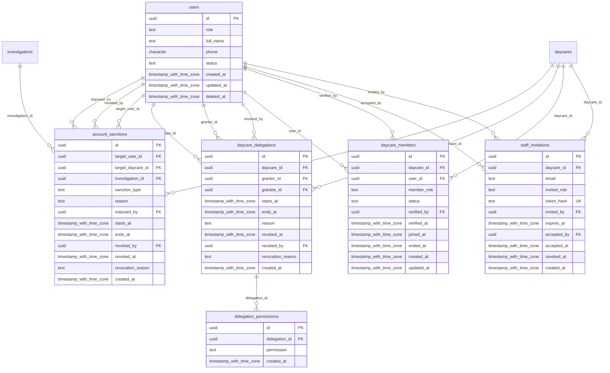
```mermaid
erDiagram
  users ||--o{ account_sanctions : "imposed_by"
  investigations ||--o{ account_sanctions : "investigation_id"
  users ||--o{ account_sanctions : "revoked_by"
  daycares ||--o{ account_sanctions : "target_daycare_id"
  users ||--o{ account_sanctions : "target_user_id"
  daycares ||--o{ daycare_delegations : "daycare_id"
  users ||--o{ daycare_delegations : "grantee_id"
  users ||--o{ daycare_delegations : "grantor_id"
  users ||--o{ daycare_delegations : "revoked_by"
  daycares ||--o{ daycare_members : "daycare_id"
  users ||--o{ daycare_members : "user_id"
  users ||--o{ daycare_members : "verified_by"
  daycare_delegations ||--o{ delegation_permissions : "delegation_id"
  users ||--o{ staff_invitations : "accepted_by"
  daycares ||--o{ staff_invitations : "daycare_id"
  users ||--o{ staff_invitations : "invited_by"
  users {
    uuid id PK
    text role
    text full_name
    character phone
    text status
    timestamp_with_time_zone created_at
    timestamp_with_time_zone updated_at
    timestamp_with_time_zone deleted_at
  }
  daycare_members {
    uuid id PK
    uuid daycare_id FK
    uuid user_id FK
    text member_role
    text status
    uuid verified_by FK
    timestamp_with_time_zone verified_at
    timestamp_with_time_zone joined_at
    timestamp_with_time_zone ended_at
    timestamp_with_time_zone created_at
    timestamp_with_time_zone updated_at
  }
  staff_invitations {
    uuid id PK
    uuid daycare_id FK
    text email
    text invited_role
    text token_hash UK
    uuid invited_by FK
    timestamp_with_time_zone expires_at
    uuid accepted_by FK
    timestamp_with_time_zone accepted_at
    timestamp_with_time_zone revoked_at
    timestamp_with_time_zone created_at
  }
  daycare_delegations {
    uuid id PK
    uuid daycare_id FK
    uuid grantor_id FK
    uuid grantee_id FK
    timestamp_with_time_zone starts_at
    timestamp_with_time_zone ends_at
    text reason
    timestamp_with_time_zone revoked_at
    uuid revoked_by FK
    text revocation_reason
    timestamp_with_time_zone created_at
  }
  delegation_permissions {
    uuid id PK
    uuid delegation_id FK
    text permission
    timestamp_with_time_zone created_at
  }
  account_sanctions {
    uuid id PK
    uuid target_user_id FK
    uuid target_daycare_id FK
    uuid investigation_id FK
    text sanction_type
    text reason
    uuid imposed_by FK
    timestamp_with_time_zone starts_at
    timestamp_with_time_zone ends_at
    uuid revoked_by FK
    timestamp_with_time_zone revoked_at
    text revocation_reason
    timestamp_with_time_zone created_at
  }
```

## 2. Daycare & katalog

Tabel: `daycares`, `daycare_listings`, `daycare_listing_profiles`, `daycare_photos`, `service_offerings`, `service_price_versions`, `commission_rules`. Tabel dari domain lain yang dirujuk ditampilkan tanpa kolom.

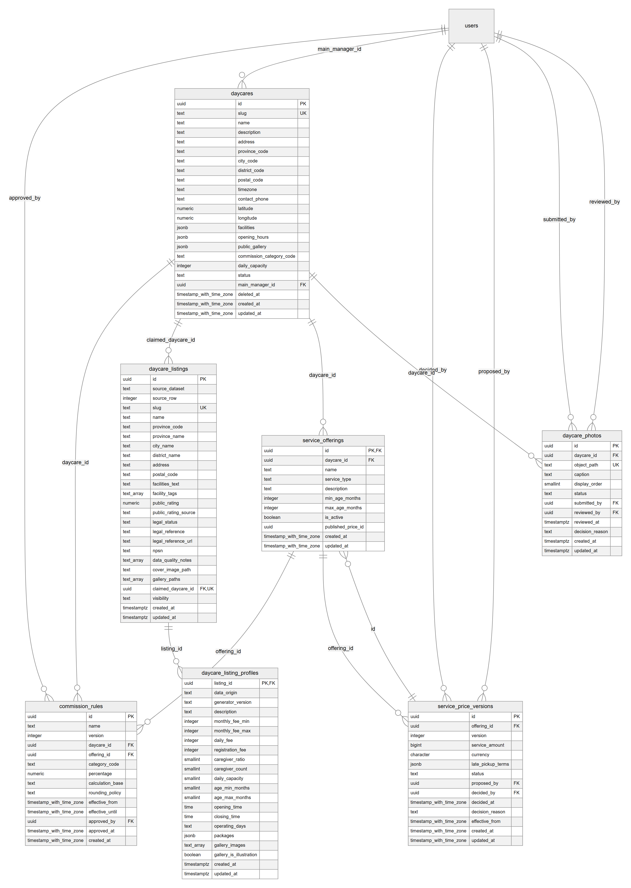

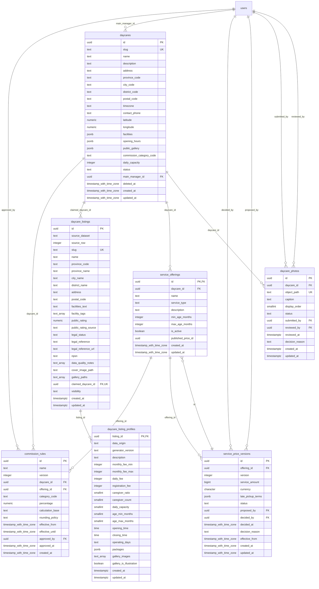
```mermaid
erDiagram
  users ||--o{ commission_rules : "approved_by"
  daycares ||--o{ commission_rules : "daycare_id"
  service_offerings ||--o{ commission_rules : "offering_id"
  daycare_listings ||--o{ daycare_listing_profiles : "listing_id"
  daycares ||--o{ daycare_listings : "claimed_daycare_id"
  users ||--o{ daycares : "main_manager_id"
  daycares ||--o{ service_offerings : "daycare_id"
  service_price_versions ||--o{ service_offerings : "id"
  users ||--o{ service_price_versions : "decided_by"
  service_offerings ||--o{ service_price_versions : "offering_id"
  users ||--o{ service_price_versions : "proposed_by"
  daycares ||--o{ daycare_photos : "daycare_id"
  users ||--o{ daycare_photos : "submitted_by"
  users ||--o{ daycare_photos : "reviewed_by"
  daycares {
    uuid id PK
    text slug UK
    text name
    text description
    text address
    text province_code
    text city_code
    text district_code
    text postal_code
    text timezone
    text contact_phone
    numeric latitude
    numeric longitude
    jsonb facilities
    jsonb opening_hours
    jsonb public_gallery
    text commission_category_code
    integer daily_capacity
    text status
    uuid main_manager_id FK
    timestamp_with_time_zone deleted_at
    timestamp_with_time_zone created_at
    timestamp_with_time_zone updated_at
  }
  daycare_listings {
    uuid id PK
    text source_dataset
    integer source_row
    text slug UK
    text name
    text province_code
    text province_name
    text city_name
    text district_name
    text address
    text postal_code
    text facilities_text
    text_array facility_tags
    numeric public_rating
    text public_rating_source
    text legal_status
    text legal_reference
    text legal_reference_url
    text npsn
    text_array data_quality_notes
    text cover_image_path
    text_array gallery_paths
    uuid claimed_daycare_id FK, UK
    text visibility
    timestamptz created_at
    timestamptz updated_at
  }
  daycare_listing_profiles {
    uuid listing_id PK, FK
    text data_origin
    text generator_version
    text description
    integer monthly_fee_min
    integer monthly_fee_max
    integer daily_fee
    integer registration_fee
    smallint caregiver_ratio
    smallint caregiver_count
    smallint daily_capacity
    smallint age_min_months
    smallint age_max_months
    time opening_time
    time closing_time
    text operating_days
    jsonb packages
    text_array gallery_images
    boolean gallery_is_illustration
    timestamptz created_at
    timestamptz updated_at
  }
  daycare_photos {
    uuid id PK
    uuid daycare_id FK
    text object_path UK
    text caption
    smallint display_order
    text status
    uuid submitted_by FK
    uuid reviewed_by FK
    timestamptz reviewed_at
    text decision_reason
    timestamptz created_at
    timestamptz updated_at
  }
  service_offerings {
    uuid id PK, FK
    uuid daycare_id FK
    text name
    text service_type
    text description
    integer min_age_months
    integer max_age_months
    boolean is_active
    uuid published_price_id
    timestamp_with_time_zone created_at
    timestamp_with_time_zone updated_at
  }
  service_price_versions {
    uuid id PK
    uuid offering_id FK
    integer version
    bigint service_amount
    character currency
    jsonb late_pickup_terms
    text status
    uuid proposed_by FK
    uuid decided_by FK
    timestamp_with_time_zone decided_at
    text decision_reason
    timestamp_with_time_zone effective_from
    timestamp_with_time_zone created_at
    timestamp_with_time_zone updated_at
  }
  commission_rules {
    uuid id PK
    text name
    integer version
    uuid daycare_id FK
    uuid offering_id FK
    text category_code
    numeric percentage
    text calculation_base
    text rounding_policy
    timestamp_with_time_zone effective_from
    timestamp_with_time_zone effective_until
    uuid approved_by FK
    timestamp_with_time_zone approved_at
    timestamp_with_time_zone created_at
  }
```

## 3. Anak

Tabel: `children`, `child_health_profiles`, `child_health_change_logs`, `child_health_correction_requests`. Tabel dari domain lain yang dirujuk ditampilkan tanpa kolom.

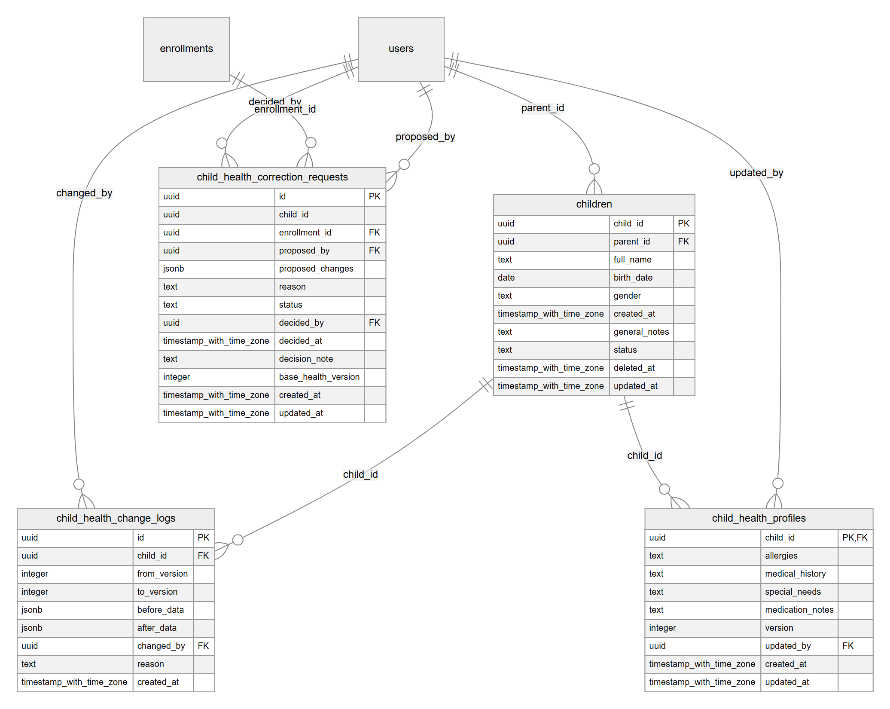

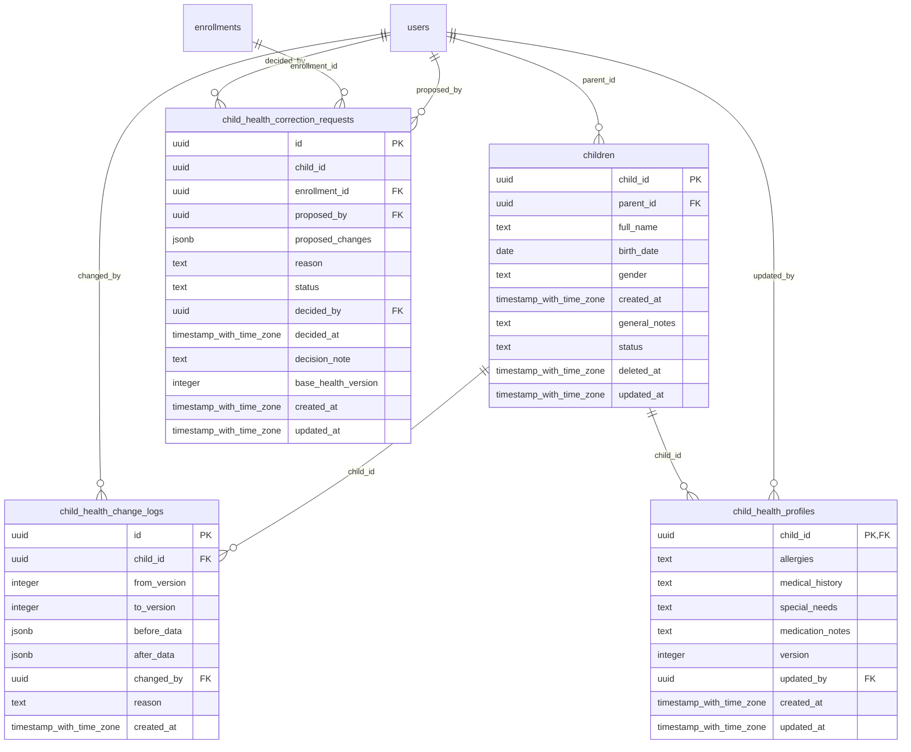
```mermaid
erDiagram
  users ||--o{ child_health_change_logs : "changed_by"
  children ||--o{ child_health_change_logs : "child_id"
  users ||--o{ child_health_correction_requests : "decided_by"
  enrollments ||--o{ child_health_correction_requests : "enrollment_id"
  users ||--o{ child_health_correction_requests : "proposed_by"
  children ||--o{ child_health_profiles : "child_id"
  users ||--o{ child_health_profiles : "updated_by"
  users ||--o{ children : "parent_id"
  children {
    uuid child_id PK
    uuid parent_id FK
    text full_name
    date birth_date
    text gender
    timestamp_with_time_zone created_at
    text general_notes
    text status
    timestamp_with_time_zone deleted_at
    timestamp_with_time_zone updated_at
  }
  child_health_profiles {
    uuid child_id PK, FK
    text allergies
    text medical_history
    text special_needs
    text medication_notes
    integer version
    uuid updated_by FK
    timestamp_with_time_zone created_at
    timestamp_with_time_zone updated_at
  }
  child_health_change_logs {
    uuid id PK
    uuid child_id FK
    integer from_version
    integer to_version
    jsonb before_data
    jsonb after_data
    uuid changed_by FK
    text reason
    timestamp_with_time_zone created_at
  }
  child_health_correction_requests {
    uuid id PK
    uuid child_id
    uuid enrollment_id FK
    uuid proposed_by FK
    jsonb proposed_changes
    text reason
    text status
    uuid decided_by FK
    timestamp_with_time_zone decided_at
    text decision_note
    integer base_health_version
    timestamp_with_time_zone created_at
    timestamp_with_time_zone updated_at
  }
```

## 4. Pendaftaran

Tabel: `enrollments`, `enrollment_service_dates`, `enrollment_consents`, `enrollment_status_logs`, `caregiver_assignments`. Tabel dari domain lain yang dirujuk ditampilkan tanpa kolom.

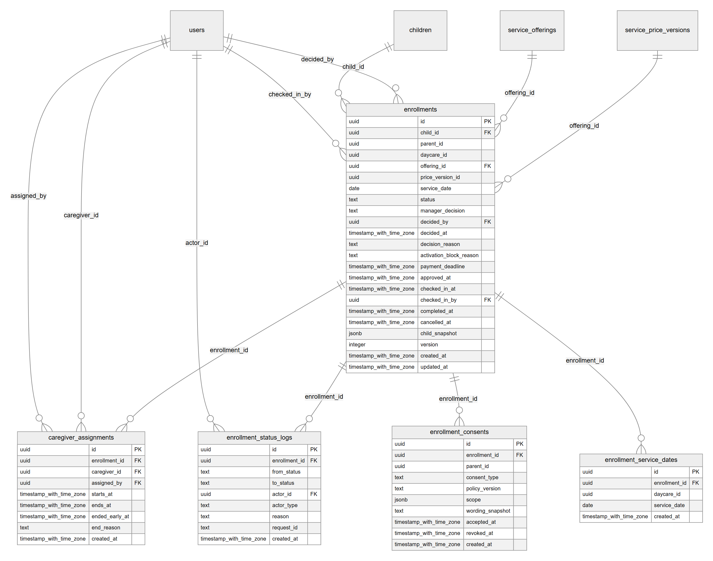

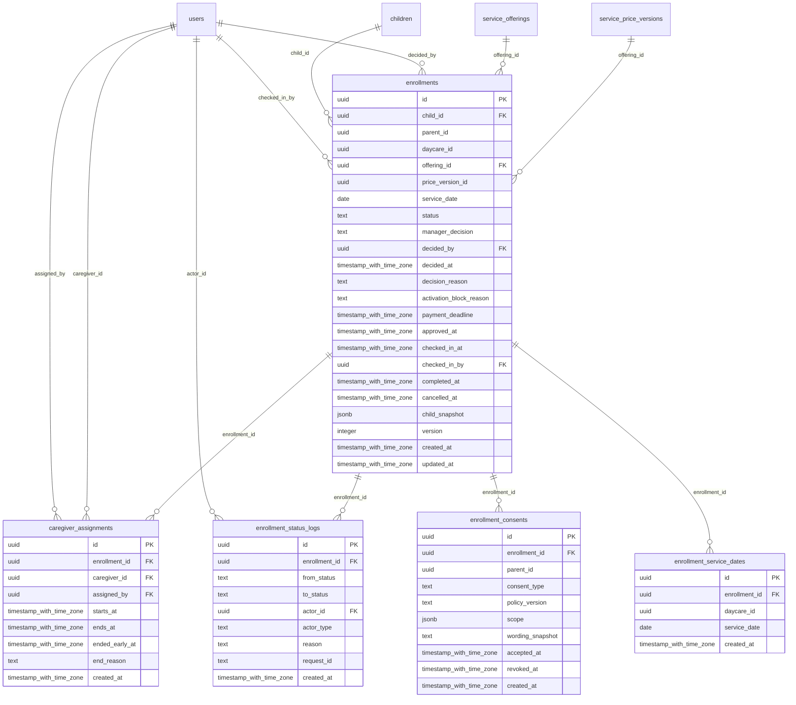
```mermaid
erDiagram
  users ||--o{ caregiver_assignments : "assigned_by"
  users ||--o{ caregiver_assignments : "caregiver_id"
  enrollments ||--o{ caregiver_assignments : "enrollment_id"
  enrollments ||--o{ enrollment_consents : "enrollment_id"
  enrollments ||--o{ enrollment_service_dates : "enrollment_id"
  users ||--o{ enrollment_status_logs : "actor_id"
  enrollments ||--o{ enrollment_status_logs : "enrollment_id"
  users ||--o{ enrollments : "checked_in_by"
  children ||--o{ enrollments : "child_id"
  users ||--o{ enrollments : "decided_by"
  service_offerings ||--o{ enrollments : "offering_id"
  service_price_versions ||--o{ enrollments : "offering_id"
  enrollments {
    uuid id PK
    uuid child_id FK
    uuid parent_id
    uuid daycare_id
    uuid offering_id FK
    uuid price_version_id
    date service_date
    text status
    text manager_decision
    uuid decided_by FK
    timestamp_with_time_zone decided_at
    text decision_reason
    text activation_block_reason
    timestamp_with_time_zone payment_deadline
    timestamp_with_time_zone approved_at
    timestamp_with_time_zone checked_in_at
    uuid checked_in_by FK
    timestamp_with_time_zone completed_at
    timestamp_with_time_zone cancelled_at
    jsonb child_snapshot
    integer version
    timestamp_with_time_zone created_at
    timestamp_with_time_zone updated_at
  }
  enrollment_service_dates {
    uuid id PK
    uuid enrollment_id FK
    uuid daycare_id
    date service_date
    timestamp_with_time_zone created_at
  }
  enrollment_consents {
    uuid id PK
    uuid enrollment_id FK
    uuid parent_id
    text consent_type
    text policy_version
    jsonb scope
    text wording_snapshot
    timestamp_with_time_zone accepted_at
    timestamp_with_time_zone revoked_at
    timestamp_with_time_zone created_at
  }
  enrollment_status_logs {
    uuid id PK
    uuid enrollment_id FK
    text from_status
    text to_status
    uuid actor_id FK
    text actor_type
    text reason
    text request_id
    timestamp_with_time_zone created_at
  }
  caregiver_assignments {
    uuid id PK
    uuid enrollment_id FK
    uuid caregiver_id FK
    uuid assigned_by FK
    timestamp_with_time_zone starts_at
    timestamp_with_time_zone ends_at
    timestamp_with_time_zone ended_early_at
    text end_reason
    timestamp_with_time_zone created_at
  }
```

## 5. Pembayaran

Tabel: `charges`, `transactions`, `payment_details`, `payment_webhook_events`, `refunds`, `financial_holds`, `payouts`, `payout_items`, `daycare_payout_accounts`, `payout_account_change_requests`. Tabel dari domain lain yang dirujuk ditampilkan tanpa kolom.

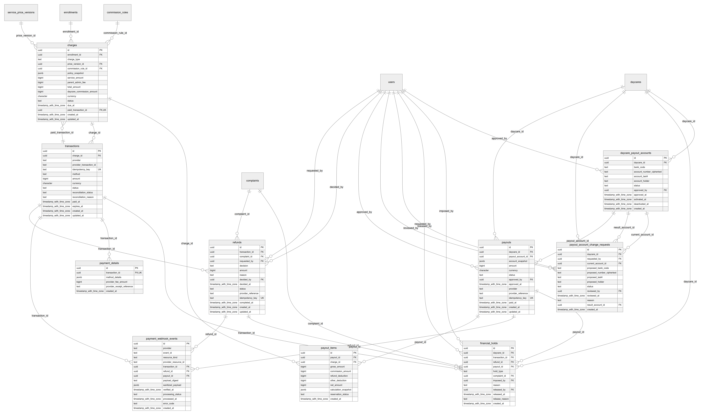

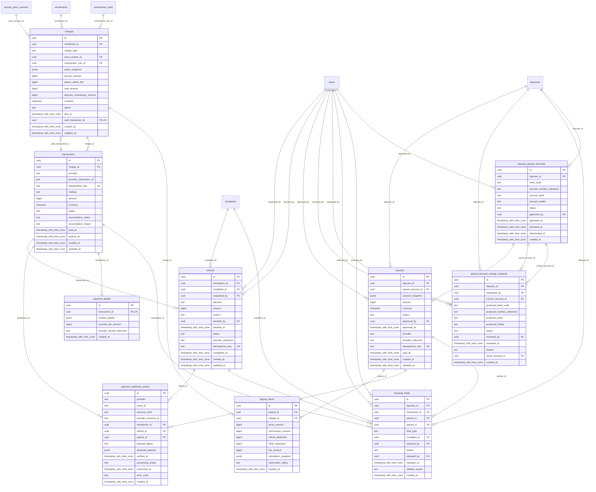
```mermaid
erDiagram
  commission_rules ||--o{ charges : "commission_rule_id"
  enrollments ||--o{ charges : "enrollment_id"
  transactions ||--o{ charges : "paid_transaction_id"
  service_price_versions ||--o{ charges : "price_version_id"
  users ||--o{ daycare_payout_accounts : "approved_by"
  daycares ||--o{ daycare_payout_accounts : "daycare_id"
  complaints ||--o{ financial_holds : "complaint_id"
  daycares ||--o{ financial_holds : "daycare_id"
  users ||--o{ financial_holds : "imposed_by"
  payouts ||--o{ financial_holds : "payout_id"
  refunds ||--o{ financial_holds : "refund_id"
  users ||--o{ financial_holds : "released_by"
  transactions ||--o{ financial_holds : "transaction_id"
  transactions ||--o{ payment_details : "transaction_id"
  payouts ||--o{ payment_webhook_events : "payout_id"
  refunds ||--o{ payment_webhook_events : "refund_id"
  transactions ||--o{ payment_webhook_events : "transaction_id"
  daycare_payout_accounts ||--o{ payout_account_change_requests : "current_account_id"
  daycare_payout_accounts ||--o{ payout_account_change_requests : "result_account_id"
  daycares ||--o{ payout_account_change_requests : "daycare_id"
  users ||--o{ payout_account_change_requests : "requested_by"
  users ||--o{ payout_account_change_requests : "reviewed_by"
  charges ||--o{ payout_items : "charge_id"
  payouts ||--o{ payout_items : "payout_id"
  users ||--o{ payouts : "approved_by"
  daycares ||--o{ payouts : "daycare_id"
  daycare_payout_accounts ||--o{ payouts : "payout_account_id"
  complaints ||--o{ refunds : "complaint_id"
  users ||--o{ refunds : "decided_by"
  users ||--o{ refunds : "requested_by"
  transactions ||--o{ refunds : "transaction_id"
  charges ||--o{ transactions : "charge_id"
  charges {
    uuid id PK
    uuid enrollment_id FK
    text charge_type
    uuid price_version_id FK
    uuid commission_rule_id FK
    jsonb policy_snapshot
    bigint service_amount
    bigint parent_admin_fee
    bigint total_amount
    bigint daycare_commission_amount
    character currency
    text status
    timestamp_with_time_zone due_at
    uuid paid_transaction_id FK, UK
    timestamp_with_time_zone created_at
    timestamp_with_time_zone updated_at
  }
  transactions {
    uuid id PK
    uuid charge_id FK
    text provider
    text provider_transaction_id
    text idempotency_key UK
    text method
    bigint amount
    character currency
    text status
    text reconciliation_status
    text reconciliation_reason
    timestamp_with_time_zone paid_at
    timestamp_with_time_zone expires_at
    timestamp_with_time_zone created_at
    timestamp_with_time_zone updated_at
  }
  payment_details {
    uuid id PK
    uuid transaction_id FK, UK
    jsonb method_details
    bigint provider_fee_amount
    text provider_receipt_reference
    timestamp_with_time_zone created_at
  }
  payment_webhook_events {
    uuid id PK
    text provider
    text event_id
    text resource_kind
    text provider_resource_id
    uuid transaction_id FK
    uuid refund_id FK
    uuid payout_id FK
    text payload_digest
    jsonb sanitized_payload
    timestamp_with_time_zone verified_at
    text processing_status
    timestamp_with_time_zone processed_at
    text error_code
    timestamp_with_time_zone created_at
  }
  refunds {
    uuid id PK
    uuid transaction_id FK
    uuid complaint_id FK
    uuid requested_by FK
    text decision
    bigint amount
    text reason
    uuid decided_by FK
    timestamp_with_time_zone decided_at
    text status
    text provider_reference
    text idempotency_key UK
    timestamp_with_time_zone completed_at
    timestamp_with_time_zone created_at
    timestamp_with_time_zone updated_at
  }
  financial_holds {
    uuid id PK
    uuid daycare_id FK
    uuid transaction_id FK
    uuid refund_id FK
    uuid payout_id FK
    text hold_type
    uuid complaint_id FK
    uuid imposed_by FK
    text reason
    uuid released_by FK
    timestamp_with_time_zone released_at
    text release_reason
    timestamp_with_time_zone created_at
  }
  payouts {
    uuid id PK
    uuid daycare_id FK
    uuid payout_account_id FK
    jsonb account_snapshot
    bigint amount
    character currency
    text status
    uuid approved_by FK
    timestamp_with_time_zone approved_at
    text provider
    text provider_reference
    text idempotency_key UK
    timestamp_with_time_zone paid_at
    timestamp_with_time_zone created_at
    timestamp_with_time_zone updated_at
  }
  payout_items {
    uuid id PK
    uuid payout_id FK
    uuid charge_id FK
    bigint gross_amount
    bigint commission_amount
    bigint refund_deduction
    bigint other_deduction
    bigint net_amount
    jsonb calculation_snapshot
    text reservation_status
    timestamp_with_time_zone created_at
  }
  daycare_payout_accounts {
    uuid id PK
    uuid daycare_id FK
    text bank_code
    text account_number_ciphertext
    text account_last4
    text account_holder
    text status
    uuid approved_by FK
    timestamp_with_time_zone approved_at
    timestamp_with_time_zone activated_at
    timestamp_with_time_zone deactivated_at
    timestamp_with_time_zone created_at
  }
  payout_account_change_requests {
    uuid id PK
    uuid daycare_id FK
    uuid requested_by FK
    uuid current_account_id FK
    text proposed_bank_code
    text proposed_number_ciphertext
    text proposed_last4
    text proposed_holder
    text status
    uuid reviewed_by FK
    timestamp_with_time_zone reviewed_at
    text reason
    uuid result_account_id FK
    timestamp_with_time_zone created_at
  }
```

## 6. Catatan harian & media

Tabel: `daily_reports`, `daily_report_activities`, `activity_comments`, `activity_reactions`, `activity_acknowledgements`, `report_change_logs`, `attachments`, `attachment_variants`. Tabel dari domain lain yang dirujuk ditampilkan tanpa kolom.

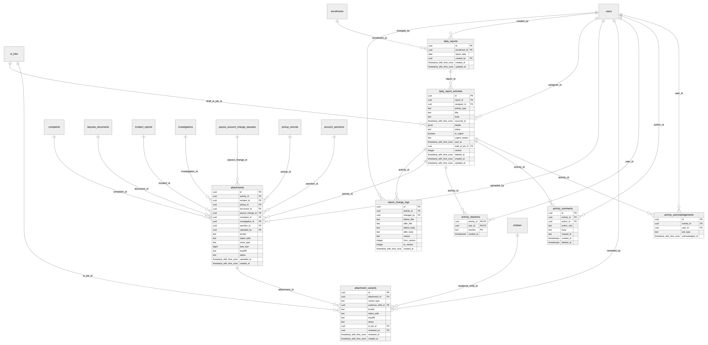

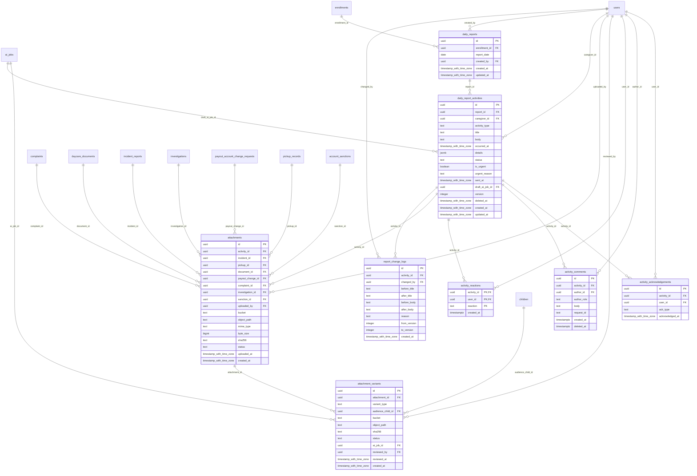
```mermaid
erDiagram
  daily_report_activities ||--o{ activity_acknowledgements : "activity_id"
  users ||--o{ activity_acknowledgements : "user_id"
  daily_report_activities ||--o{ activity_comments : "activity_id"
  users ||--o{ activity_comments : "author_id"
  daily_report_activities ||--o{ activity_reactions : "activity_id"
  users ||--o{ activity_reactions : "user_id"
  ai_jobs ||--o{ attachment_variants : "ai_job_id"
  attachments ||--o{ attachment_variants : "attachment_id"
  children ||--o{ attachment_variants : "audience_child_id"
  users ||--o{ attachment_variants : "reviewed_by"
  daily_report_activities ||--o{ attachments : "activity_id"
  complaints ||--o{ attachments : "complaint_id"
  daycare_documents ||--o{ attachments : "document_id"
  incident_reports ||--o{ attachments : "incident_id"
  investigations ||--o{ attachments : "investigation_id"
  payout_account_change_requests ||--o{ attachments : "payout_change_id"
  pickup_records ||--o{ attachments : "pickup_id"
  account_sanctions ||--o{ attachments : "sanction_id"
  users ||--o{ attachments : "uploaded_by"
  users ||--o{ daily_report_activities : "caregiver_id"
  ai_jobs ||--o{ daily_report_activities : "draft_ai_job_id"
  daily_reports ||--o{ daily_report_activities : "report_id"
  users ||--o{ daily_reports : "created_by"
  enrollments ||--o{ daily_reports : "enrollment_id"
  daily_report_activities ||--o{ report_change_logs : "activity_id"
  users ||--o{ report_change_logs : "changed_by"
  daily_reports {
    uuid id PK
    uuid enrollment_id FK
    date report_date
    uuid created_by FK
    timestamp_with_time_zone created_at
    timestamp_with_time_zone updated_at
  }
  daily_report_activities {
    uuid id PK
    uuid report_id FK
    uuid caregiver_id FK
    text activity_type
    text title
    text body
    timestamp_with_time_zone occurred_at
    jsonb details
    text status
    boolean is_urgent
    text urgent_reason
    timestamp_with_time_zone sent_at
    uuid draft_ai_job_id FK
    integer version
    timestamp_with_time_zone deleted_at
    timestamp_with_time_zone created_at
    timestamp_with_time_zone updated_at
  }
  activity_comments {
    uuid id PK
    uuid activity_id FK
    uuid author_id FK
    text author_role
    text body
    text request_id
    timestamptz created_at
    timestamptz deleted_at
  }
  activity_reactions {
    uuid activity_id PK, FK
    uuid user_id PK, FK
    text reaction PK
    timestamptz created_at
  }
  activity_acknowledgements {
    uuid id PK
    uuid activity_id FK
    uuid user_id FK
    text ack_type
    timestamp_with_time_zone acknowledged_at
  }
  report_change_logs {
    uuid id PK
    uuid activity_id FK
    uuid changed_by FK
    text before_title
    text after_title
    text before_body
    text after_body
    text reason
    integer from_version
    integer to_version
    timestamp_with_time_zone created_at
  }
  attachments {
    uuid id PK
    uuid activity_id FK
    uuid incident_id FK
    uuid pickup_id FK
    uuid document_id FK
    uuid payout_change_id FK
    uuid complaint_id FK
    uuid investigation_id FK
    uuid sanction_id FK
    uuid uploaded_by FK
    text bucket
    text object_path
    text mime_type
    bigint byte_size
    text sha256
    text status
    timestamp_with_time_zone uploaded_at
    timestamp_with_time_zone created_at
  }
  attachment_variants {
    uuid id PK
    uuid attachment_id FK
    text variant_type
    uuid audience_child_id FK
    text bucket
    text object_path
    text sha256
    text status
    uuid ai_job_id FK
    uuid reviewed_by FK
    timestamp_with_time_zone reviewed_at
    timestamp_with_time_zone created_at
  }
```

## 7. Penjemputan

Tabel: `authorized_pickups`, `pickup_records`. Tabel dari domain lain yang dirujuk ditampilkan tanpa kolom.

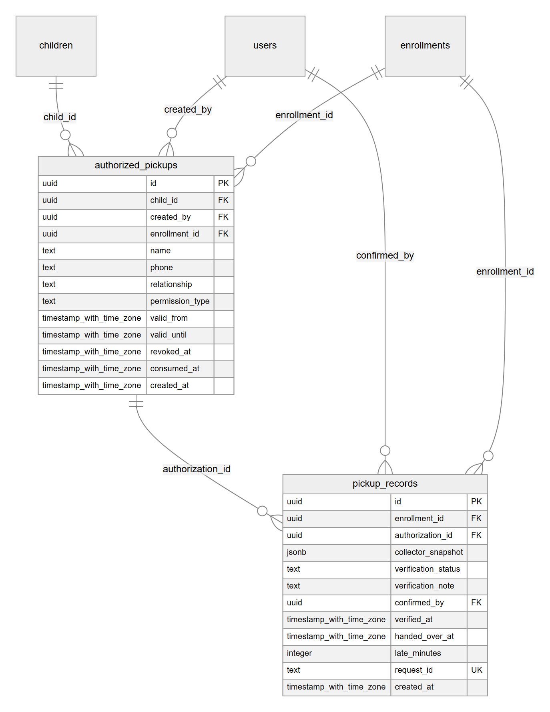

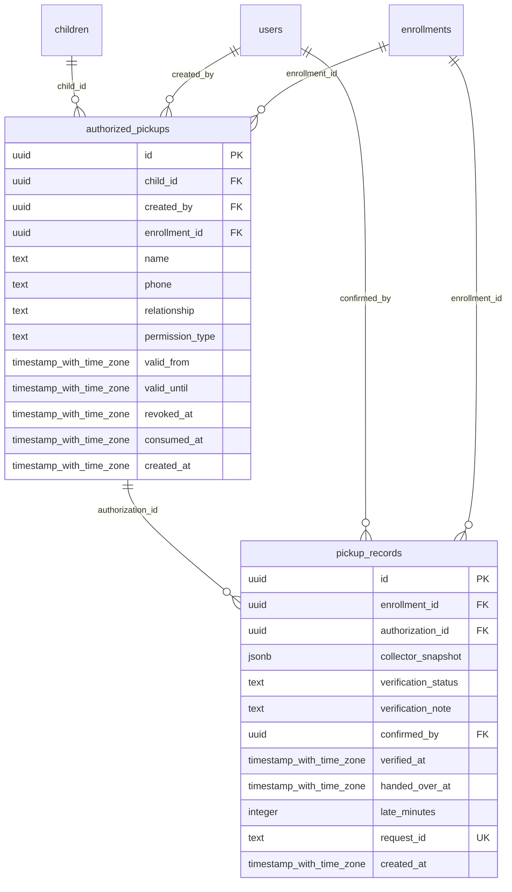
```mermaid
erDiagram
  children ||--o{ authorized_pickups : "child_id"
  users ||--o{ authorized_pickups : "created_by"
  enrollments ||--o{ authorized_pickups : "enrollment_id"
  authorized_pickups ||--o{ pickup_records : "authorization_id"
  users ||--o{ pickup_records : "confirmed_by"
  enrollments ||--o{ pickup_records : "enrollment_id"
  authorized_pickups {
    uuid id PK
    uuid child_id FK
    uuid created_by FK
    uuid enrollment_id FK
    text name
    text phone
    text relationship
    text permission_type
    timestamp_with_time_zone valid_from
    timestamp_with_time_zone valid_until
    timestamp_with_time_zone revoked_at
    timestamp_with_time_zone consumed_at
    timestamp_with_time_zone created_at
  }
  pickup_records {
    uuid id PK
    uuid enrollment_id FK
    uuid authorization_id FK
    jsonb collector_snapshot
    text verification_status
    text verification_note
    uuid confirmed_by FK
    timestamp_with_time_zone verified_at
    timestamp_with_time_zone handed_over_at
    integer late_minutes
    text request_id UK
    timestamp_with_time_zone created_at
  }
```

## 8. Insiden

Tabel: `incident_reports`, `incident_ai_analyses`, `incident_urgency_change_logs`, `incident_status_logs`, `incident_parent_acknowledgements`. Tabel dari domain lain yang dirujuk ditampilkan tanpa kolom.

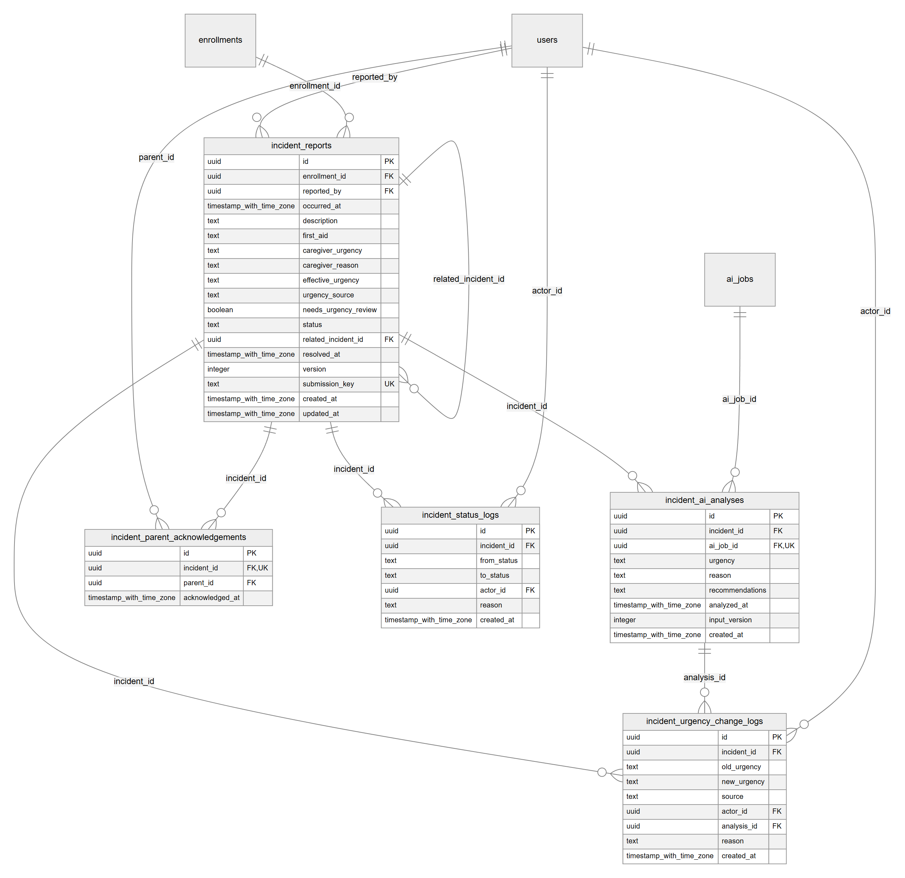

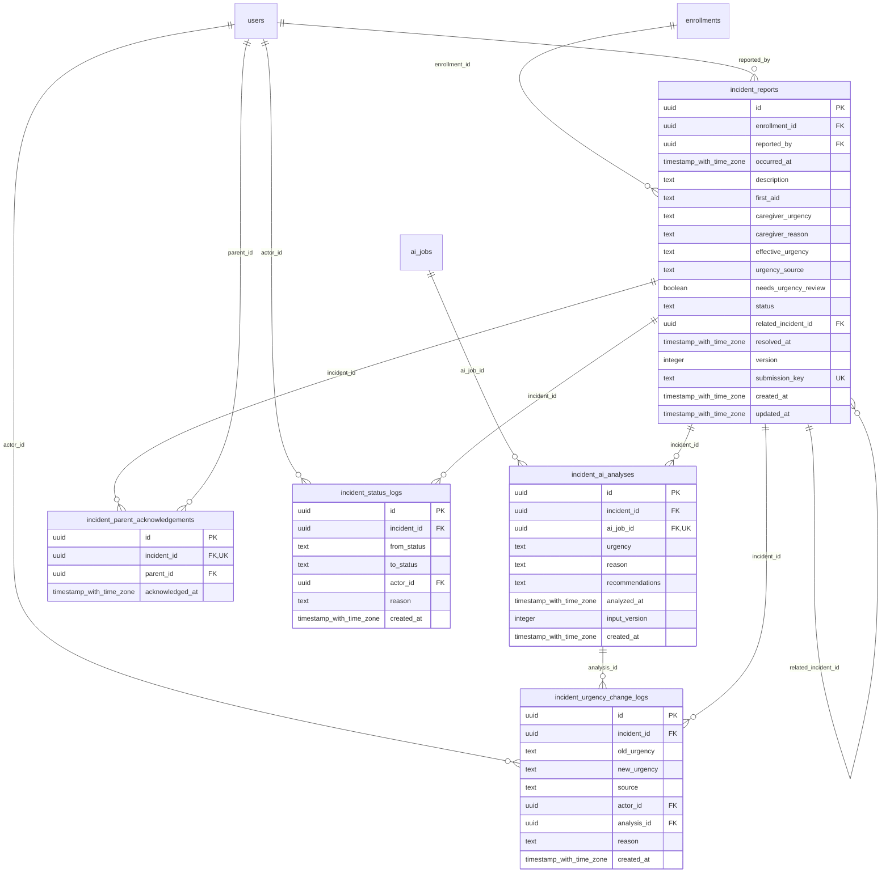
```mermaid
erDiagram
  ai_jobs ||--o{ incident_ai_analyses : "ai_job_id"
  incident_reports ||--o{ incident_ai_analyses : "incident_id"
  incident_reports ||--o{ incident_parent_acknowledgements : "incident_id"
  users ||--o{ incident_parent_acknowledgements : "parent_id"
  enrollments ||--o{ incident_reports : "enrollment_id"
  incident_reports ||--o{ incident_reports : "related_incident_id"
  users ||--o{ incident_reports : "reported_by"
  users ||--o{ incident_status_logs : "actor_id"
  incident_reports ||--o{ incident_status_logs : "incident_id"
  users ||--o{ incident_urgency_change_logs : "actor_id"
  incident_ai_analyses ||--o{ incident_urgency_change_logs : "analysis_id"
  incident_reports ||--o{ incident_urgency_change_logs : "incident_id"
  incident_reports {
    uuid id PK
    uuid enrollment_id FK
    uuid reported_by FK
    timestamp_with_time_zone occurred_at
    text description
    text first_aid
    text caregiver_urgency
    text caregiver_reason
    text effective_urgency
    text urgency_source
    boolean needs_urgency_review
    text status
    uuid related_incident_id FK
    timestamp_with_time_zone resolved_at
    integer version
    text submission_key UK
    timestamp_with_time_zone created_at
    timestamp_with_time_zone updated_at
  }
  incident_ai_analyses {
    uuid id PK
    uuid incident_id FK
    uuid ai_job_id FK, UK
    text urgency
    text reason
    text recommendations
    timestamp_with_time_zone analyzed_at
    integer input_version
    timestamp_with_time_zone created_at
  }
  incident_urgency_change_logs {
    uuid id PK
    uuid incident_id FK
    text old_urgency
    text new_urgency
    text source
    uuid actor_id FK
    uuid analysis_id FK
    text reason
    timestamp_with_time_zone created_at
  }
  incident_status_logs {
    uuid id PK
    uuid incident_id FK
    text from_status
    text to_status
    uuid actor_id FK
    text reason
    timestamp_with_time_zone created_at
  }
  incident_parent_acknowledgements {
    uuid id PK
    uuid incident_id FK, UK
    uuid parent_id FK
    timestamp_with_time_zone acknowledged_at
  }
```

## 9. Legalitas & Safety Score

Tabel: `daycare_documents`, `daycare_verifications`, `daycare_safety_scores`. Tabel dari domain lain yang dirujuk ditampilkan tanpa kolom.

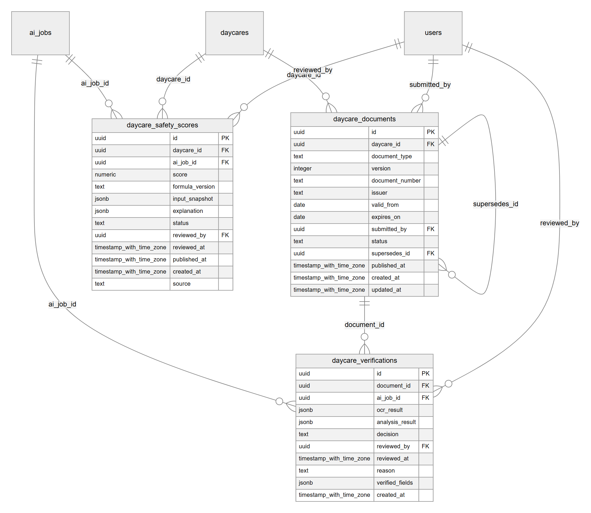

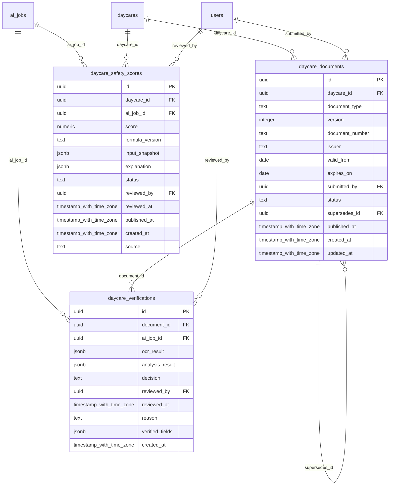
```mermaid
erDiagram
  daycares ||--o{ daycare_documents : "daycare_id"
  users ||--o{ daycare_documents : "submitted_by"
  daycare_documents ||--o{ daycare_documents : "supersedes_id"
  ai_jobs ||--o{ daycare_safety_scores : "ai_job_id"
  daycares ||--o{ daycare_safety_scores : "daycare_id"
  users ||--o{ daycare_safety_scores : "reviewed_by"
  ai_jobs ||--o{ daycare_verifications : "ai_job_id"
  daycare_documents ||--o{ daycare_verifications : "document_id"
  users ||--o{ daycare_verifications : "reviewed_by"
  daycare_documents {
    uuid id PK
    uuid daycare_id FK
    text document_type
    integer version
    text document_number
    text issuer
    date valid_from
    date expires_on
    uuid submitted_by FK
    text status
    uuid supersedes_id FK
    timestamp_with_time_zone published_at
    timestamp_with_time_zone created_at
    timestamp_with_time_zone updated_at
  }
  daycare_verifications {
    uuid id PK
    uuid document_id FK
    uuid ai_job_id FK
    jsonb ocr_result
    jsonb analysis_result
    text decision
    uuid reviewed_by FK
    timestamp_with_time_zone reviewed_at
    text reason
    jsonb verified_fields
    timestamp_with_time_zone created_at
  }
  daycare_safety_scores {
    uuid id PK
    uuid daycare_id FK
    uuid ai_job_id FK
    numeric score
    text formula_version
    jsonb input_snapshot
    jsonb explanation
    text status
    uuid reviewed_by FK
    timestamp_with_time_zone reviewed_at
    timestamp_with_time_zone published_at
    timestamp_with_time_zone created_at
    text source
  }
```

## 10. Ulasan

Tabel: `reviews`, `review_versions`, `review_replies`, `review_reply_versions`. Tabel dari domain lain yang dirujuk ditampilkan tanpa kolom.

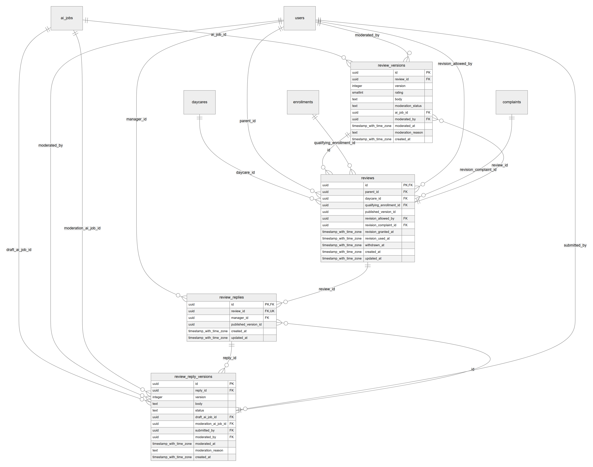

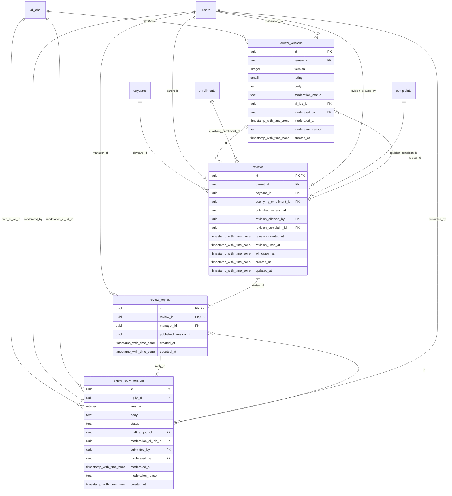
```mermaid
erDiagram
  users ||--o{ review_replies : "manager_id"
  review_reply_versions ||--o{ review_replies : "id"
  reviews ||--o{ review_replies : "review_id"
  ai_jobs ||--o{ review_reply_versions : "draft_ai_job_id"
  users ||--o{ review_reply_versions : "moderated_by"
  ai_jobs ||--o{ review_reply_versions : "moderation_ai_job_id"
  review_replies ||--o{ review_reply_versions : "reply_id"
  users ||--o{ review_reply_versions : "submitted_by"
  ai_jobs ||--o{ review_versions : "ai_job_id"
  users ||--o{ review_versions : "moderated_by"
  reviews ||--o{ review_versions : "review_id"
  daycares ||--o{ reviews : "daycare_id"
  users ||--o{ reviews : "parent_id"
  review_versions ||--o{ reviews : "id"
  enrollments ||--o{ reviews : "qualifying_enrollment_id"
  users ||--o{ reviews : "revision_allowed_by"
  complaints ||--o{ reviews : "revision_complaint_id"
  reviews {
    uuid id PK, FK
    uuid parent_id FK
    uuid daycare_id FK
    uuid qualifying_enrollment_id FK
    uuid published_version_id
    uuid revision_allowed_by FK
    uuid revision_complaint_id FK
    timestamp_with_time_zone revision_granted_at
    timestamp_with_time_zone revision_used_at
    timestamp_with_time_zone withdrawn_at
    timestamp_with_time_zone created_at
    timestamp_with_time_zone updated_at
  }
  review_versions {
    uuid id PK
    uuid review_id FK
    integer version
    smallint rating
    text body
    text moderation_status
    uuid ai_job_id FK
    uuid moderated_by FK
    timestamp_with_time_zone moderated_at
    text moderation_reason
    timestamp_with_time_zone created_at
  }
  review_replies {
    uuid id PK, FK
    uuid review_id FK, UK
    uuid manager_id FK
    uuid published_version_id
    timestamp_with_time_zone created_at
    timestamp_with_time_zone updated_at
  }
  review_reply_versions {
    uuid id PK
    uuid reply_id FK
    integer version
    text body
    text status
    uuid draft_ai_job_id FK
    uuid moderation_ai_job_id FK
    uuid submitted_by FK
    uuid moderated_by FK
    timestamp_with_time_zone moderated_at
    text moderation_reason
    timestamp_with_time_zone created_at
  }
```

## 11. Komplain & investigasi

Tabel: `complaints`, `complaint_status_logs`, `complaint_assignments`, `investigations`, `admin_actions`. Tabel dari domain lain yang dirujuk ditampilkan tanpa kolom.

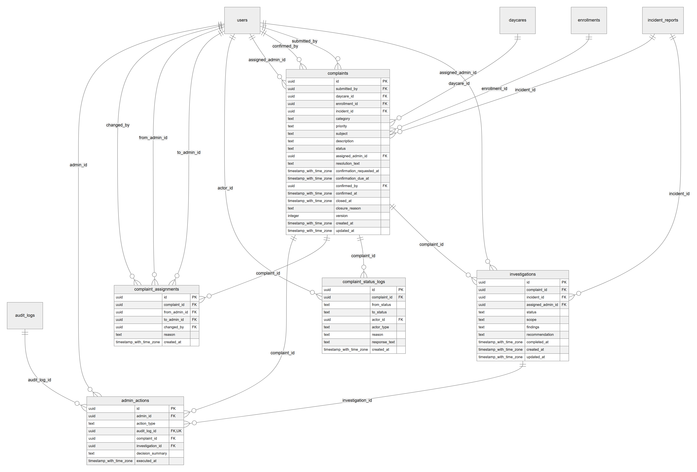

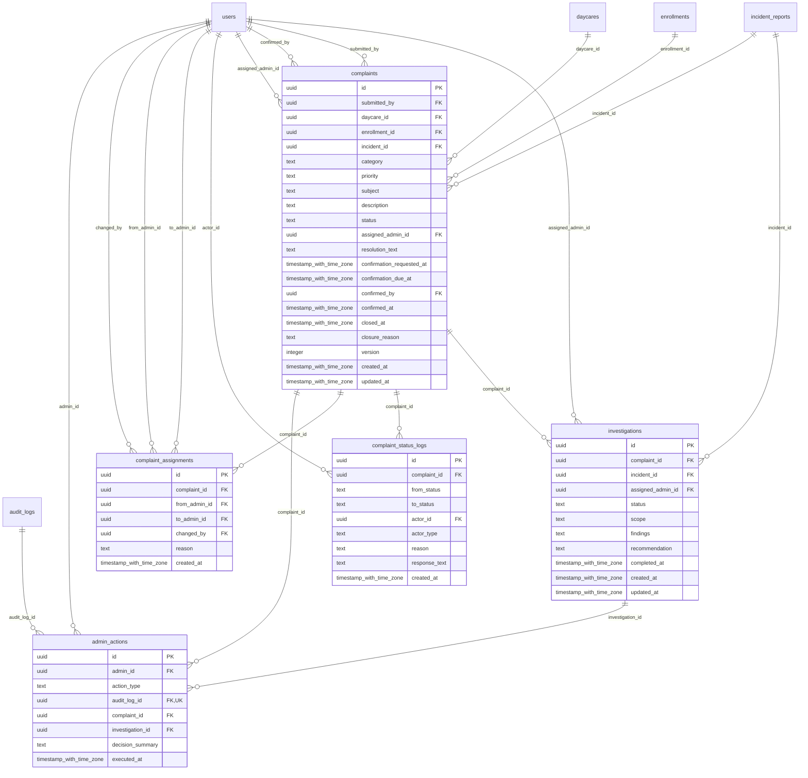
```mermaid
erDiagram
  users ||--o{ admin_actions : "admin_id"
  audit_logs ||--o{ admin_actions : "audit_log_id"
  complaints ||--o{ admin_actions : "complaint_id"
  investigations ||--o{ admin_actions : "investigation_id"
  users ||--o{ complaint_assignments : "changed_by"
  complaints ||--o{ complaint_assignments : "complaint_id"
  users ||--o{ complaint_assignments : "from_admin_id"
  users ||--o{ complaint_assignments : "to_admin_id"
  users ||--o{ complaint_status_logs : "actor_id"
  complaints ||--o{ complaint_status_logs : "complaint_id"
  users ||--o{ complaints : "assigned_admin_id"
  users ||--o{ complaints : "confirmed_by"
  daycares ||--o{ complaints : "daycare_id"
  enrollments ||--o{ complaints : "enrollment_id"
  incident_reports ||--o{ complaints : "incident_id"
  users ||--o{ complaints : "submitted_by"
  users ||--o{ investigations : "assigned_admin_id"
  complaints ||--o{ investigations : "complaint_id"
  incident_reports ||--o{ investigations : "incident_id"
  complaints {
    uuid id PK
    uuid submitted_by FK
    uuid daycare_id FK
    uuid enrollment_id FK
    uuid incident_id FK
    text category
    text priority
    text subject
    text description
    text status
    uuid assigned_admin_id FK
    text resolution_text
    timestamp_with_time_zone confirmation_requested_at
    timestamp_with_time_zone confirmation_due_at
    uuid confirmed_by FK
    timestamp_with_time_zone confirmed_at
    timestamp_with_time_zone closed_at
    text closure_reason
    integer version
    timestamp_with_time_zone created_at
    timestamp_with_time_zone updated_at
  }
  complaint_status_logs {
    uuid id PK
    uuid complaint_id FK
    text from_status
    text to_status
    uuid actor_id FK
    text actor_type
    text reason
    text response_text
    timestamp_with_time_zone created_at
  }
  complaint_assignments {
    uuid id PK
    uuid complaint_id FK
    uuid from_admin_id FK
    uuid to_admin_id FK
    uuid changed_by FK
    text reason
    timestamp_with_time_zone created_at
  }
  investigations {
    uuid id PK
    uuid complaint_id FK
    uuid incident_id FK
    uuid assigned_admin_id FK
    text status
    text scope
    text findings
    text recommendation
    timestamp_with_time_zone completed_at
    timestamp_with_time_zone created_at
    timestamp_with_time_zone updated_at
  }
  admin_actions {
    uuid id PK
    uuid admin_id FK
    text action_type
    uuid audit_log_id FK, UK
    uuid complaint_id FK
    uuid investigation_id FK
    text decision_summary
    timestamp_with_time_zone executed_at
  }
```

## 12. Notifikasi

Tabel: `notifications`, `notification_receipts`, `notification_reminders`, `notification_delivery_logs`. Tabel dari domain lain yang dirujuk ditampilkan tanpa kolom.

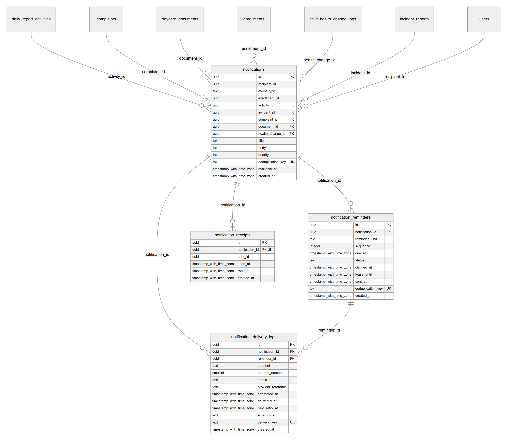

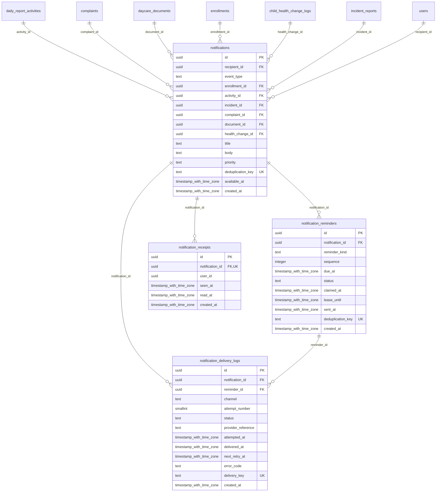
```mermaid
erDiagram
  notifications ||--o{ notification_delivery_logs : "notification_id"
  notification_reminders ||--o{ notification_delivery_logs : "reminder_id"
  notifications ||--o{ notification_receipts : "notification_id"
  notifications ||--o{ notification_reminders : "notification_id"
  daily_report_activities ||--o{ notifications : "activity_id"
  complaints ||--o{ notifications : "complaint_id"
  daycare_documents ||--o{ notifications : "document_id"
  enrollments ||--o{ notifications : "enrollment_id"
  child_health_change_logs ||--o{ notifications : "health_change_id"
  incident_reports ||--o{ notifications : "incident_id"
  users ||--o{ notifications : "recipient_id"
  notifications {
    uuid id PK
    uuid recipient_id FK
    text event_type
    uuid enrollment_id FK
    uuid activity_id FK
    uuid incident_id FK
    uuid complaint_id FK
    uuid document_id FK
    uuid health_change_id FK
    text title
    text body
    text priority
    text deduplication_key UK
    timestamp_with_time_zone available_at
    timestamp_with_time_zone created_at
  }
  notification_receipts {
    uuid id PK
    uuid notification_id FK, UK
    uuid user_id
    timestamp_with_time_zone seen_at
    timestamp_with_time_zone read_at
    timestamp_with_time_zone created_at
  }
  notification_reminders {
    uuid id PK
    uuid notification_id FK
    text reminder_kind
    integer sequence
    timestamp_with_time_zone due_at
    text status
    timestamp_with_time_zone claimed_at
    timestamp_with_time_zone lease_until
    timestamp_with_time_zone sent_at
    text deduplication_key UK
    timestamp_with_time_zone created_at
  }
  notification_delivery_logs {
    uuid id PK
    uuid notification_id FK
    uuid reminder_id FK
    text channel
    smallint attempt_number
    text status
    text provider_reference
    timestamp_with_time_zone attempted_at
    timestamp_with_time_zone delivered_at
    timestamp_with_time_zone next_retry_at
    text error_code
    text delivery_key UK
    timestamp_with_time_zone created_at
  }
```

## 13. AI, sistem & audit

Tabel: `ai_jobs`, `system_settings`, `audit_logs`. Tabel dari domain lain yang dirujuk ditampilkan tanpa kolom.

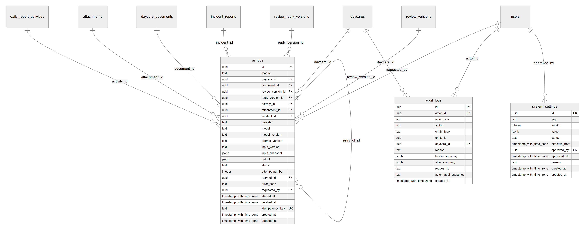

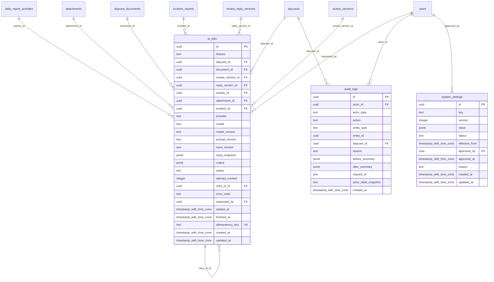
```mermaid
erDiagram
  daily_report_activities ||--o{ ai_jobs : "activity_id"
  attachments ||--o{ ai_jobs : "attachment_id"
  daycares ||--o{ ai_jobs : "daycare_id"
  daycare_documents ||--o{ ai_jobs : "document_id"
  incident_reports ||--o{ ai_jobs : "incident_id"
  review_reply_versions ||--o{ ai_jobs : "reply_version_id"
  users ||--o{ ai_jobs : "requested_by"
  ai_jobs ||--o{ ai_jobs : "retry_of_id"
  review_versions ||--o{ ai_jobs : "review_version_id"
  users ||--o{ audit_logs : "actor_id"
  daycares ||--o{ audit_logs : "daycare_id"
  users ||--o{ system_settings : "approved_by"
  ai_jobs {
    uuid id PK
    text feature
    uuid daycare_id FK
    uuid document_id FK
    uuid review_version_id FK
    uuid reply_version_id FK
    uuid activity_id FK
    uuid attachment_id FK
    uuid incident_id FK
    text provider
    text model
    text model_version
    text prompt_version
    text input_version
    jsonb input_snapshot
    jsonb output
    text status
    integer attempt_number
    uuid retry_of_id FK
    text error_code
    uuid requested_by FK
    timestamp_with_time_zone started_at
    timestamp_with_time_zone finished_at
    text idempotency_key UK
    timestamp_with_time_zone created_at
    timestamp_with_time_zone updated_at
  }
  system_settings {
    uuid id PK
    text key
    integer version
    jsonb value
    text status
    timestamp_with_time_zone effective_from
    uuid approved_by FK
    timestamp_with_time_zone approved_at
    text reason
    timestamp_with_time_zone created_at
    timestamp_with_time_zone updated_at
  }
  audit_logs {
    uuid id PK
    uuid actor_id FK
    text actor_type
    text action
    text entity_type
    uuid entity_id
    uuid daycare_id FK
    text reason
    jsonb before_summary
    jsonb after_summary
    text request_id
    text actor_label_snapshot
    timestamp_with_time_zone created_at
  }
```
